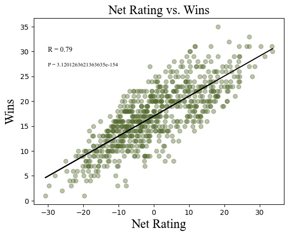

# 🏀 College Basketball Analysis

This project explores NCAA college basketball team statistics from a recent season using **pandas**, **numpy**, **scipy**, **matplotlib**, and **seaborn**. It answers questions about team performance, efficiency, and rankings to showcase fundamental data analysis skills.

## 🔍 Objectives

1. Clean and explore basketball team data using pandas and numpy:
  - What are the column names in the dataset?
  - How many rows and columns are in the dataset?
  - What are the data types of each column?
  - Verify if there are any missing values in the dataset
  
2. Visualize trends and relationships using seaborn, scipy and matplotlib
3. Answer real-world questions like:
  - Which team won the season?
  - Which team had the best offensive rating?

## 📊 Dataset

- Source: [Kaggle/NCAA Dataset] 
- Format: Excel (.xlsx)

## 🧪 Technologies Used

- Python 3
- pandas
- numpy
- seaborn
- Jupyter Notebook
- Scipy
- Matplotlib

## Data Vitalization

