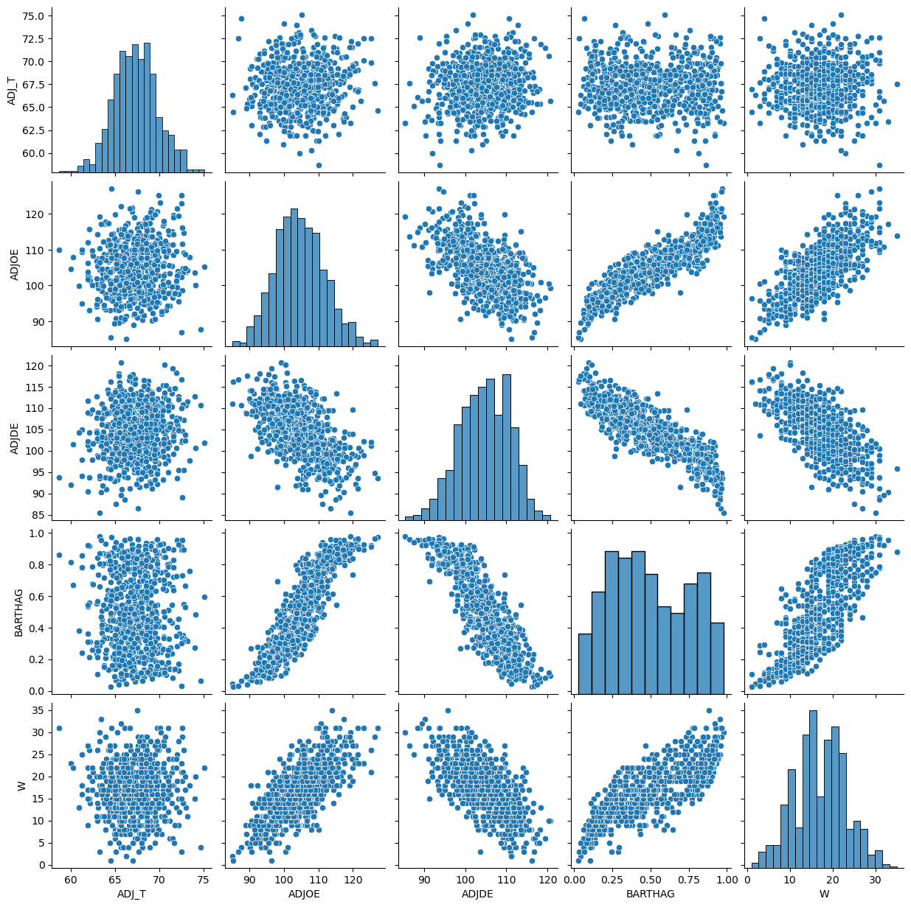

# 🏀 College Basketball Analysis

This project explores NCAA college basketball team statistics from a recent season using **pandas**, **numpy**, **scipy**, **matplotlib**, and **seaborn**. It answers questions about team performance, efficiency, and rankings to showcase fundamental data analysis skills.

## 🔍 Objectives

1. Clean and explore basketball team data using pandas and numpy:
  - What are the column names in the dataset?
  - How many rows and columns are in the dataset?
  - What are the data types of each column?
  - Verify if there are any missing values in the dataset
  
2. Visualize trends and relationships using seaborn, scipy and matplotlib
3. Answer real-world questions like:
  - Which team won the season?
  - Which team had the best offensive rating?

## 📊 Dataset

- Source: [Kaggle/NCAA Dataset] 
- Format: Excel (.xlsx)

## 🧪 Technologies Used

- Python 3
- pandas
- numpy
- seaborn
- Jupyter Notebook
- Scipy
- Matplotlib

## Data Vitalization

### Net Rating
A positive net rating indicates team is scoring more than they give up to opponents. Negative indicates they are giving up more points than they are earning.

The linear regression graph shows the correlation between net rating and team wins.

### Pair Plot
The pair plot visualizes:

* The relationship between each pair of variables 
* The distribution of each variable individually

The pair plot shows strong relationships between team strength (BARTHAG) and both offensive (ADJOE) and defensive efficiency (ADJDE). Wins (W) also follow this pattern, stronger, more efficient teams win more games. Interestingly, tempo (ADJ_T) has little impact on team strength or success, suggesting that how efficiently a team plays matters more than how fast it plays.